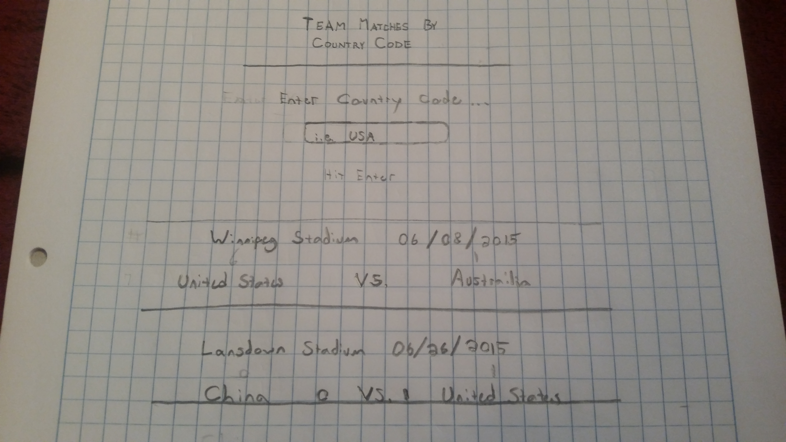

# Team Matches by Country Code

##### API
http://worldcup.sfg.io/

##### Fifa Country Codes
https://en.wikipedia.org/wiki/List_of_FIFA_country_codes

##### User
* A user can type in a `COUNTRY_CODE`
* A user can click `Submit`

#### App error
* App can display error if timeout
* App can display error if wrong country code

#### App loading
* App can display LOADING message
* App can fade LOADING message when complete

#### App goal
* App can list all matches played by that team

###### Packages
`React`, `Redux`, `Fetch`, `Thunk`

###### CSS processor
`LESS`

  
>TODO: Questions

* What are source maps? Are these useful for this project?
* Webpack dev server does not compile less
* Why use Redux Thunk or Saga for such a simple request!?
  * It seems that the API returns a 500 error first then returns JSON
  * Maybe we need to handle responses or promises or wait for second response

> PROBLEMS
* I am getting a 500 server error FIRST, then a 200 with the JSON data.
